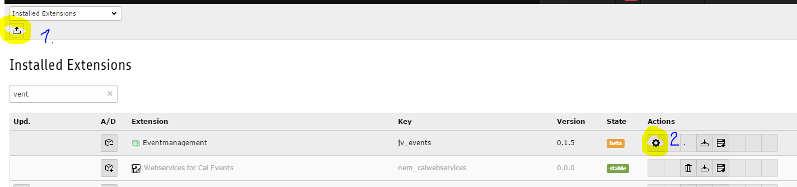
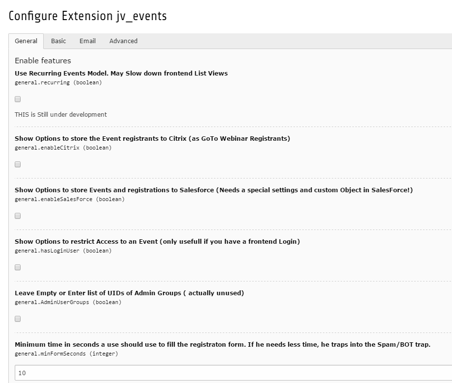

.. ==================================================
.. FOR YOUR INFORMATION
.. --------------------------------------------------
.. -*- coding: utf-8 -*- with BOM.

.. include:: ../Includes.txt

.. _admin-manual:

Administrator Manual
====================

Target group: **Administrators**

.. _admin-installation:

Installation
------------

To install the extension, perform the following steps:

#. Go to the Extension Manager
#. Install the extension and use the Configuration Options
#. Load the static template
#. Copy needed Templates/Partials to your own Template Folder and adapt them...

   Extension Manager (caption of the image)

   Options in Extension Manager (caption of the image)

.. _admin-configuration:

Configuration
-------------
	I hope the Wording the EM -> Configure -> Options dialog is self explaining. 
	if not, send me a message and i add this 

.. _admin-faq:

FAQ
---

Requirements
^^^^^^^^^^^^

   #. The extension is made and tested with TYPO3 7.6 LTS.
   Versions below are not tested and may not work.
   TYPO3 8.x LTS compatibility will be added, when available

   #. You need Bootstrap 3.3 installed or have to style all Templates on your Own.
   Important: The extension does not automatically include the Bootstrap LIBS !!!)

   #. You need jQuery 1.8 or higher installed if you want to use the Filter in List View 

   #. With registration form you will need static_info_tables and their localisations

MicroFormat
^^^^^^^^^^^

This Extension has a partial called "MicroFormat"
See also 
https://search.google.com/structured-data/testing-tool/u/0/?hl=de

This MicroFormat Partial in *"ld/json"* Format is called from Single Event View and List View and Create a JSON-LD Objekt like this

.. code-block:: javascript
   :linenos:
   :emphasize-lines: 2-4

    {
	    "@context" : "http://schema.org",
	    "@type" : "Event",
	    "name" : "Band in Berlin",
        "image" : "http://www.example.com/image.jpg",
	    "startDate" : "2016-04-20T20:00",
        "endDate" : "2016-04-20T22:00",
	    "url" : "http://www.example.com/events/band/2016-04-20-2000",
        "performer" : "Name of Organizer",
        "description" : "beschreibung",
	     "offers" : {
	        "@type": "AggregateOffer",
	        "url" : "http://www.example.com/events/band/2016-04-20-2000/tickets",
	        "lowPrice" : "100",
	        "offerCount" : "1839"
	    },
	    "location" :
	    {
	        "@type" : "Place",
	        "sameAs" : "http://www.veranstaltungsort-berlin.de/",
	        "name" : "Veranstaltungsort",
	        "address" :
	            {
                  "@type" : "PostalAddress",
	              "streetAddress" : "Beispielstaße 1",
	              "addressLocality" : "Berlin",
	              "postalCode" : "10243"
	            }
	      }
	}

